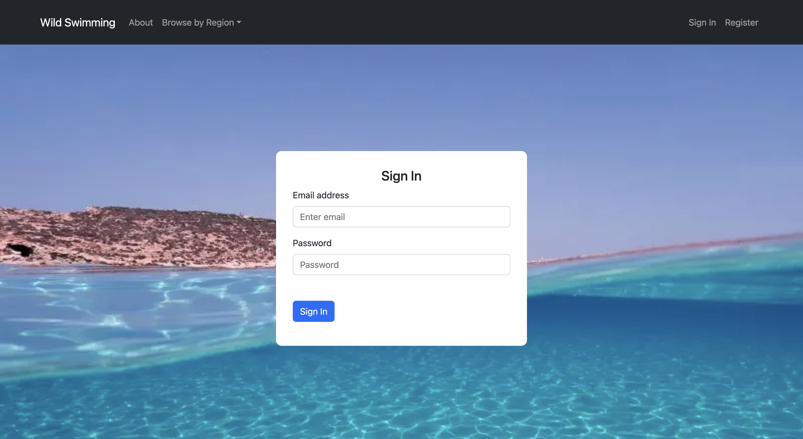
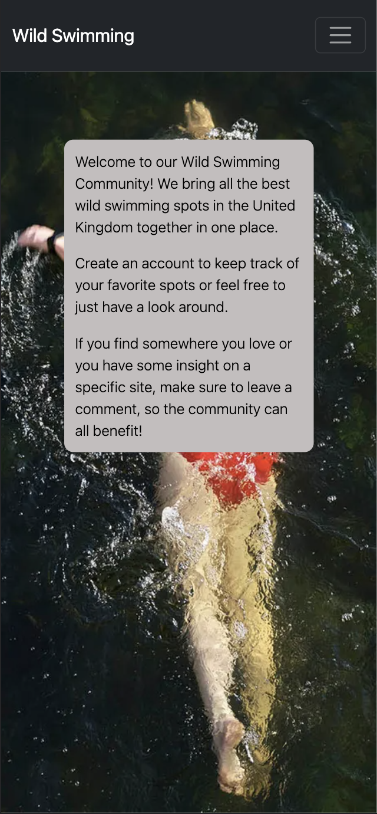
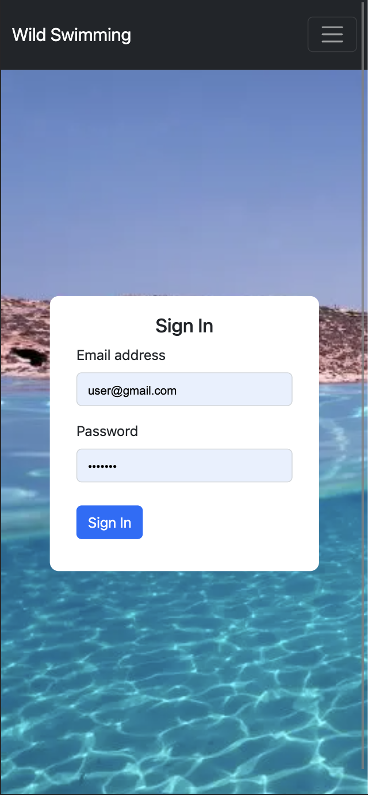
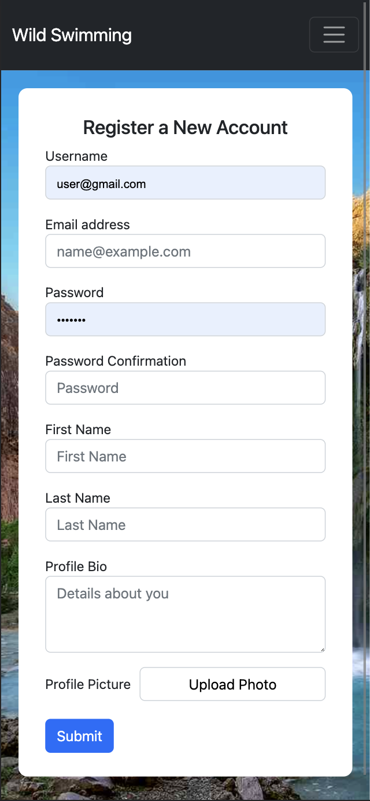
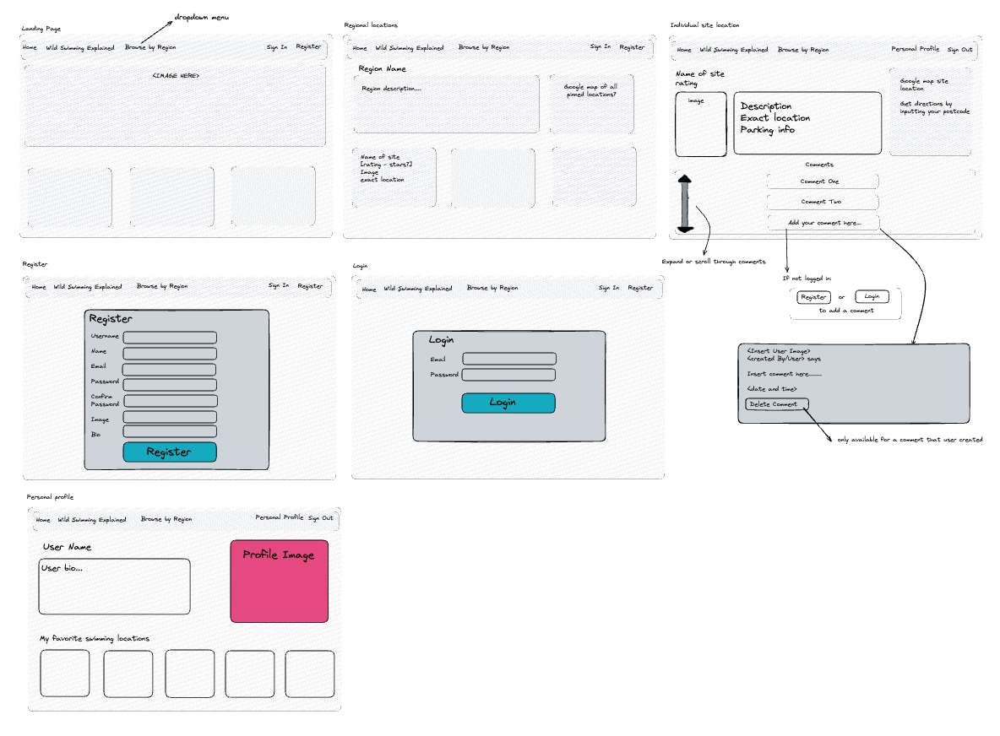
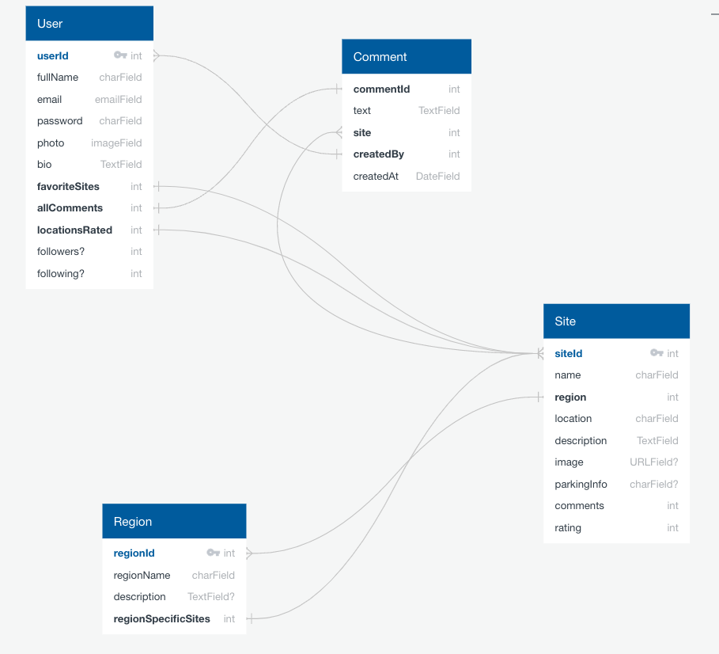
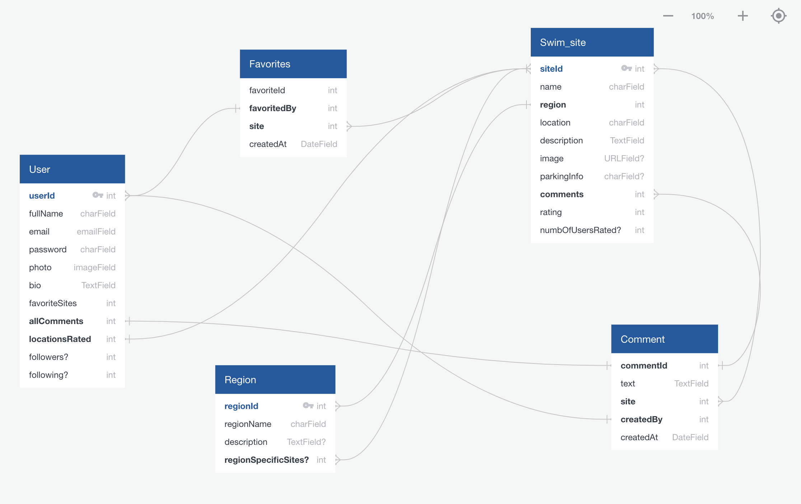
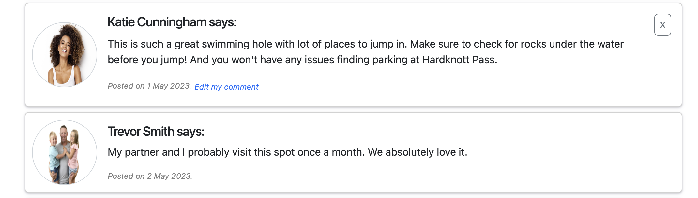

# Wild Swimming

This was a solo project completed over a three week period. I built a full stack, mobile responsive, web application for wild swimmers. The application provides viewers with a list of wild swimming spots in the United Kingdom. When users are registered they can create a personal profile account and save their favorite sites. They can also add comments about the different sites and update and delete their own comments.

This repo contains code for the front end client only. Code for the back end api can be found [here](https://github.com/kpetersen04/Wild-Swimming-API).

## Application Visuals

<p align="center">


</p>
<p align="center">


</p>

## Responsive Design

<p align="center">



</p>

<p align="center">


</p>

## Tech Stack

Frontend

- React (SPA)
- React-Router-Dom
- Axios
- React-Bootstrap
- CSS with Sass
- Cloudinary

Backend

- Python + Django Rest Framework
- PostgreSQL
- JSON Web Token (JWT)

Development and Deployment

- Git, GitHub
- Excalidraw
- Postman
- Npm + Pipenv
- Netlify
- Heroku

## The Brief

- Build a full-stack application
- Consume an API with a separate React frontend
- Use a Python Django API using Django REST Framework to serve your data from a Postgres database
- Be a complete product with multiple relationships and CRUD functionality for different models
- Be deployed online
- Completed within a three week deadline

## Planning

I used excalidraw during my planning process to wireframe my application and get an idea of what my final application would look like. This also helped me to confirm what functionality I would require for each aspect of the application.

<p align="center">

</p>

I also used QuickDBD to create an entity relationship diagram. While this required a significant amount of effort at the start, doing this was one of the best things I did during my project as it allowed me to understand my data and how it was connected via different models. This pre-work resulted in faster code production when I started work on my back end.

As I progressed through my build, my understanding and requirements of my data changed and I continued to update my entity relationship diagram to ensure organization and full understanding throughout the project.

Here you can see my original entity relationship diagram.

<p align="center">

</p>

And here you can see the final version, which was updated as I built my application.

<p align="center">

</p>

## Building the Back End

The back end of my application was built using Python and Django Rest Framework. It includes five models - Swim site, Region, Favorite, Comment and User. By using PopulatedSerializers across these models I was able to link them together, allowing me to get information for separate models by using a get request only on one. For example by creating a PopulatedUserSerializer that contained comments and favorites, I could access the details for these two additional Models when using a get request just for the User.

```Python
class PopulatedUserSerializer(UserSerializer):
    comments = CommentSerializer(many=True)
    favorites = PopulatedFavoriteSerializer(many=True)
```

```Python
class UserDetailView(APIView):

    def get_user(self, pk):
        try:
            return User.objects.get(pk=pk)
        except User.DoesNotExist:
            raise NotFound(detail="No user with that id can be found.")

    def get(self, _request, pk):
        user = self.get_user(pk=pk)
        serialized_user = PopulatedUserSerializer(user)
        return Response(serialized_user.data, status=status.HTTP_200_OK)
```

The user favorites were also managed in the back end. When a user tries to add a favorite swim site on the frontend, the API view 'FavoriteListView' in the back end first checks that the user is permitted to add a favorite with the permission_classes = (IsAuthenticated, ).

The post method then checks if that user already has a favorite item with the same site that was created by the logged in user.

By filtering the Favorite objects with .first(), the first Favorite object found with the matching requirements is returned to confirm that it already exists. If it does already exist, a response is returned to confirm that the user has already added that particular site to their favorites. In this way the user is prevented from having duplicates of the same site added to their favorites.

If the site doesn't already exist within the user's favorites and the required data is included in the POST request to this view then a new Favorite object is created and saved for the user.

```Python
class FavoriteListView(APIView):
    permission_classes = (IsAuthenticated, )
    def post(self, request):
        fav_already_exists = Favorite.objects.filter(
        site = request.data['site'],
        created_by = request.user.id
        ).first()

        if fav_already_exists:
            return Response({'detail': "You've already saved this site as a favorite."}, status=status.HTTP_422_UNPROCESSABLE_ENTITY)
        favorite_to_create = FavoriteSerializer(data=request.data)

        try:
            favorite_to_create.is_valid()
            favorite_to_create.save()
            return Response(favorite_to_create.data, status=status.HTTP_201_CREATED)
        except IntegrityError as e:
            return Response({"detail": str(e)}, status=status.HTTP_422_UNPROCESSABLE_ENTITY)
        except AssertionError as e:
            return Response({"detail": str(e)}, status=status.HTTP_422_UNPROCESSABLE_ENTITY)
        except:
            return Response('Unprocessable Entity', status=status.HTTP_422_UNPROCESSABLE_ENTITY)
```

## Building the Front End

One of the sections I enjoyed working on the most was the comments section of a single swim sit. When a user is logged in and they are the creator of a comment, their comment view appears different to other users as they have the ability to update and/or delete their comment entirely.

<p align="center">

</p>
The alternative view is displayed when the showButtons state is set to true. This is done by checking whether the user is confirmed as the CommentOwner. A CommentOwner is determined by checking whether the created_by.id from the comments data and the userId which is stored in local Storage match.

```JavaScript
  const [showButtons, setShowButtons] = useState(isCommentOwner);
```

If the showButtons state is set to true, the following code allows the delete comment button to appear.

```JavaScript
   <div className="comment-title">
          <Card.Title>
            {firstName} {lastName} says:
          </Card.Title>
          {showButtons && (
            <>
              {!isEditing && (
                <Button
                  variant="outline-secondary"
                  className="_delete-button"
                  onClick={deleteComment}
                >
                  x
                </Button>
              )}
            </>
          )}
        </div>
```

In a separate section of the comment card, the showButton state that has a value of true would allow the 'Edit my comment' button to be displayed. By doing this, only the user who created the comment is able to update and/or delete their own comment.

```JavaScript
<Card.Text className="date-stamp-text">
            Posted on {commentPosted}.{" "}
            {showButtons && (
              <Button
                className="edit-comment-button"
                variant="link"
                size="sm"
                onClick={(e) => setIsEditing(true)}
              >
                Edit my comment
              </Button>
            )}
          </Card.Text>
```

Included within the first showButtons code above (starts with a div with a classname of ‘comment-title’) is a nested ternary operator and if the isEditing state is set to false, then the button to delete comment is available to the user. However, if the isEditing state is set to true, the comment delete button is removed.

This is because when the idEditing state is set to true, the below code is included in the comment card which allows the user to update their comment text. If they decide they don't want to update the text after pressing 'Edit my comment' the new 'close-update-button' that appears to the right of the text will allow the user to exit the update without making any changes. The onClick callback function also updates the isEditing state back to false, meaning that the delete comment button will re-appear.

```JavaScript
{isEditing ? (
            <Form
              className="comment-text with-button"
              onSubmit={submitUpdatedComment}
            >
              <Form.Control
                className="comment-text-field"
                type="text"
                value={updatedComment.text}
                name="text"
                onChange={(e) =>
                  setUpdatedComment({
                    ...updatedComment,
                    text: e.target.value,
                  })
                }
              />
              <Button
                variant="outline-secondary"
                className="close-update-button"
                onClick={(e) => setIsEditing(false)}
              >
                x
              </Button>
            </Form>
          ) : (
            <Card.Text className="comment-text">{text}</Card.Text>
          )}
```

Another aspect of my code which I was quite proud of is managing the favoriting of swim sites. I found the POST and DELETE requests to add and delete a favorite site from a user's Favorites quite straightforward but one aspect I had to put in some extra work was getting the heart to appear favorited (outlined in red) when different users were logged in and also to remain ‘favorited’ once the user reloaded the page or moved between the application’s page and back.

To ensure a site was showing as a favorite when required, I included a separate function within the fetchData function that would set the value of the swimSiteId to data.id.

```JavaScript
   if (isLoggedIn) {
          checkForFavorite({ swimSiteId: data.id });
        }
```

The swimSiteId was then passed to the check ForFavorite function as an argument. The userFavorites was then filtered for any object where the fav.site.id matched the swimSiteId.

```JavaScript
  const checkForFavorite = async ({ swimSiteId }) => {
    try {
      const user = await axios.get(`${DEV_API_URL}/auth/user/${userId}/`);
      const userFavorites = user.data.favorites;
      const foundFavorite = userFavorites.filter(
        (fav) => fav.site.id === swimSiteId
      );

      if (foundFavorite.length === 0) {
        setIsFavorite(false);
      } else {
        const favoriteId = foundFavorite[0].id;
        setFavoriteId(foundFavorite[0].id);
        setIsFavorite(foundFavorite.length === 1);
      }
      setIsLoading(false);
      setShowError(false);
    } catch (err) {
      setIsLoading(false);
      setShowError(true);
      setError("Network Error, please try again later.");
    }
  };
```

If the foundFavorite variable had a length of one then the setIsFavorite state was updated to true and the heart would be styled with the '\_current-favorite' class giving it a red outline, if it wasn't a favorite it would appear outlined in gray.

```JavaScript
{isFavorite ? (
              <span
                className=" _heart _current-favorite"
                onClick={deleteFromFavorites}
              >
                &#9825;
              </span>
            ) : (
              <span className=" _heart _not-favorited" onClick={addToFavorites}>
                &#9825;
              </span>
            )}
          </div>
```

By doing this the user would always be able to tell which site they had favorited and could move between the pages of the application and have their favorites remain consistent.

## Wins

**Mobile responsive:** The application is fully mobile responsive. While I did use Bootstrap, which comes with some in-built responsive behavior, the majority of the pages required work with media queries to make them fully responsive. Putting in the work to make the application responsive at different views was actually something I found I significantly enjoyed.

**Full ownership:** Independently creating a full application with personal responsibility for all functionality, some of which I didn't have experience in from my previous group project. When I planned my project I did worry that perhaps I had overextended myself as I had included plans for more than we had been able to accomplish as a group of three in my previous project. But I managed to meet the required deadline with all MVP functionality I had originally planned for.

## Challenges

**Uploading a profile photo as a new user:**
My back end User model required a new user to include a profile photo when they completed registration. At first I attempted to set the profile_photo to models.ImageField(). Although I struggled to get the photo to upload I finally managed to do it with this using an onChange function used on the register form inputs. The profile photo form input accepted 'image/\*' and was set at a type of 'file'.

The onChange function took the initial reigisterFormData and spread the new content into it, taking the event target name as the property name and updating the value of it with the event target value. For the profile picture to work, I used a ternary operator to check whether the event target name was set to profile_photo. If it was, then the files array of the target element took the first file selected by the user and used that as the value of the profile_photo property.

If there is no file included then the value of the profile_photo property is left as it was assigned in its original state.

```JavaScript
  const onChange = (e) => {
    console.log(e.target.value);
    setRegisterFormData({
      ...registerFormData,
      [e.target.name]: e.target.value,
      profile_photo:
        e.target.name === "profile_photo"
          ? e.target.files[0]
          : registerFormData.profile_photo,
    });
  };
```

I then used a POST request to the database with the updated regsiterFormData , including a Content-Type "multipart/form-data" in the headers that was also posted.

```JavaScript
const response = await axios.post(
        `${DEV_API_URL}/auth/register/`,
        registerFormData,
        {
          headers: {
            "Content-Type": "multipart/form-data",
          },
        }
      );
```

In doing this I was able to upload a profile photo and save it locally to my back end code but I was not able to fetch the profile photo to be displayed on the screen.

To resolve this, I ended up using Cloudinary, a cloud-based image and video management service. By changing the onClick on my profile_photo upload button to the following function:

```JavaScript
  const uploadPhoto = (e) => {
    myWidget.open();
  };
```

and using the the myWidget variable as set out in the Cloudinary documentation I was able to get an upload widget to open that allowed the user to select a file from their local storage and upload it to my cloud environment, 'def0or8o' with an upload preset used for uploading files.

A callback function is then used when the upload is completed. If an error occurs, the error argument is set to an error message and if it is successful a URL for the uploaded file is returned.

I then used the returned url to set the value of the ImageURL and then updated the registerFormData so that the value of the profile_photo property was the returned url.

```JavaScript
 const myWidget = cloudinary.createUploadWidget(
    {
      cloudName: "de7f0or8o",
      uploadPreset: "ws_profile_photos",
    },
    (error, result) => {
      if (!error && result && result.event === "success") {
        // console.log("Done, here is the image info: ", result.info);
        const { url } = result.info;
        setRegisterFormData({
          ...registerFormData,
          profile_photo: url,
        });
      }
    }
  );
```

I found this aspect of my code quite a challenge but I was very proud in the end that I was able to find a solution that allows me to access and make use of the profile photo for the users.

## Bugs

- The ‘Add a comment’ button is not currently updated in the same way as the ‘Edit my comment’ button, so the user has to reload the page if they click on this button and then decide they don’t want to add a comment.

- When the logged in user clicks on their photo in the comments section, they navigate to ‘/user-account/7’ instead of ‘/my-account/7’. Although this is incorrect, I did ensure that a logged in user could still edit their favorites when viewing their account via ‘/user-account/7’.

## Future Features

- Add in a four star rating function by allowing users to submit a rating out of 5 for each swim site and then take the average of all ratings.
- While users are able to view the profiles of other user's via the photos on the comments, I wanted to build this out further to make it more obvious this was a feature of the application. I also wanted to add in the functionality to follow other registered users.

## Key Learnings

Although this was an independent project, I often asked my classmates for help and gave help when I or they were blocked on a piece of their code. It was amazing to see how much we could resolve together by talking through our code and having another set of eyes look at a problem.

It gave me a boost in confidence to know I could help others at this early stage in my learning process but it was also a valuable lesson in how much can be resolved without having to access the expert knowledge available to me (in the form of teachers in this situation).
